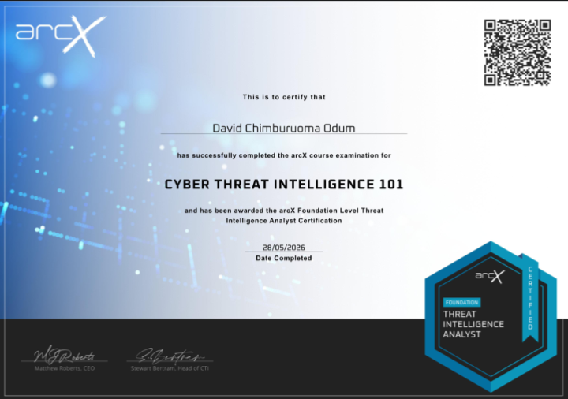
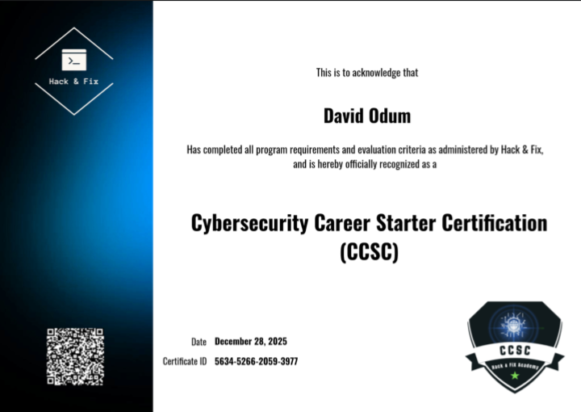
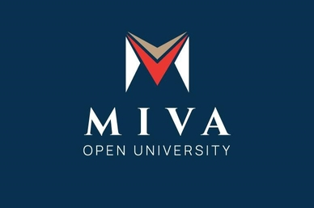

  

  

> *"Protecting systems, investigating cyber threats, and advancing digital security through intelligence, integrity, and innovation."*

---

## About Me

I am a **Cybersecurity Analyst** specializing in **Malware Analysis** and **Digital Forensics**, with a degree in **Criminology and Security Studies**.

My background combines technical cybersecurity expertise with criminological knowledge, enabling me to investigate cyber incidents, analyze malicious software, conduct forensic investigations, and understand the behavioral aspects of cybercrime.

I am passionate about protecting digital environments, uncovering cyber threats, and continuously improving my technical skills through research, hands-on labs, and real-world security challenges.

---

##  My Focus

-   Malware Analysis
-   Digital Forensics
-   Threat Detection & Incident Response
-   Cyber Threat Intelligence
-   Security Operations (SOC)
-   Building and documenting my Cybersecurity Home Lab
-   Continuous learning in offensive and defensive cybersecurity

---

##  Ask Me About

- Malware Analysis
- Digital Forensics
- Cybersecurity
- Incident Response
- Threat Hunting
- Threat Intelligence
- Security Operations (SOC)
- Cybercrime Investigation
- Cyber Awareness

---

## Technical Skills

- Malware Analysis
- Digital Forensics
- Incident Response
- Threat Hunting
- Security Operations (SOC)
- Windows Security
- Linux Security
- Network Security
- Cyber Threat Intelligence
- Digital Evidence Analysis
- OSINT
- Security Monitoring

---

##  Professional Goal

To leverage my expertise in cybersecurity, malware analysis, and digital forensics to help organizations detect, investigate, and respond to cyber threats while continuously advancing my knowledge and contributing to a more secure digital world.

---

> **"Investigating cyber threats, uncovering digital evidence, and strengthening cyber resilience through technical excellence, analytical thinking, and integrity."**
---

## Technical Proficiencies

**Operating Systems**
- Windows
- Linux

**Networking**
- TCP/IP
- HTTP
- HTTPS
- DNS
- SSH
- FTP
- Telnet

**Cybersecurity Tools**
- Wireshark
- Nmap
- Metasploit
- Autopsy
- FTK Imager
- Ghidra
- IDA Free

**Programming & Scripting**
- Python
- Bash
- PowerShell

**Virtualization**
- VMware
- VirtualBox

**Version Control**
- Git
- GitHub

---

## Projects

| Project | Description | Repository |
|----------|-------------|------------|
| OSINT Investigation | Conducted an open-source intelligence (OSINT) investigation to collect, analyze, and correlate publicly available information for digital footprint analysis. | https://github.com/davidchimburuomaodum/Enterprise-Threat-Intelligence-Assessment |
| Log Analysis Lab | Analyzed IDS alerts and Windows Event Logs to identify, investigate, and map cyber attack activity using security monitoring techniques. | https://github.com/davidchimburuomaodum/Log-Analysis |
| Malware Analysis | Performed static and dynamic malware analysis to identify malicious behavior, indicators of compromise (IOCs), and potential threats. | https://github.com/davidchimburuomaodum/enterprise-malware-analysis-bank-pdf |
| Digital Forensics | Conducted a forensic investigation of a compromised USB drive, including evidence acquisition, file recovery, timeline analysis, and reporting. | https://github.com/davidchimburuomaodum/digital-forensic-usb-examination |
| Vulnerability Assessment | Performed vulnerability scanning and security assessment of a target environment, identifying risks and recommending remediation measures. | https://github.com/davidchimburuomaodum/Vulnerability-Assessment-Project |
| SIEM | Monitored, analyzed, and investigated security events using Security Information and Event Management (SIEM) solutions to detect threats, correlate logs, and support incident response. | Coming Soon |
| Cryptography | Applied encryption, hashing, digital signatures, and key management techniques to ensure data confidentiality, integrity, and authenticity. | Coming Soon |
| Penetration Testing | Simulated a penetration test to identify security vulnerabilities, assess risks, and provide remediation recommendations. | https://github.com/davidchimburuomaodum/Penetration-Testing-Report |
| Digital Forensics CTF Case | Conducted a complete digital forensic examination of the `cartel.img` forensic image, including evidence integrity verification, file system analysis, deleted file recovery, artifact analysis, and timeline reconstruction. | https://github.com/davidchimburuomaodum/Digital-Forensics-CTF-Case..git |
| Firewall Engineering | Designed, configured, and managed firewall security policies to control network traffic, enforce access control, monitor threats, and strengthen network security through rule management and traffic filtering. | Coming Soon |
---

## Certifications

<table align="center" border="1">
<tr>

<td align="center" width="50%">
  
<b>Threat Intelligence Analyst</b>
</td>

<td align="center" width="50%">
  
<b>CCSC – Cybersecurity Career Starter Certification</b>
</td>

</tr>
</table>

---

## Education

<table align="center" border="1">
<tr>

<td align="center" width="50%">
  
<b>NIIT Port Harcourt</b> 
Cybersecurity Program
</td>

<td align="center" width="50%">
  
<b>Miva Open University</b> 
B.Sc. Criminology and Security Studies
</td>

</tr>
</table>

## Connect With Me

Let's collaborate, discuss threat intelligence, or just talk shop about security!

- 📧 **Email:** [davidchimburuomaodum@gmail.com](mailto:davidchimburuomaodum@gmail.com)
- 💬 **WhatsApp:** [+234 912 574 7577](https://wa.me/2349125747577) / [+234 812 520 8462](https://wa.me/2348125208462)

---
🔒 *Driven by integrity. Committed to security. Focused on protecting what matters most.*
